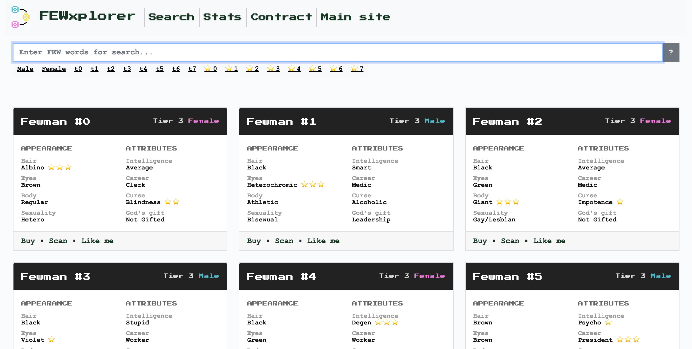

# FEWxplorer

This is source code of the frontend of the __FEWxplorer__: https://fewmans.xyz 

## Commands

`yarn` – install project's dependencies.

`make dev` – run the development environment

`make build` – make a distribution build (see `./dist` then)

`make deploy` – build and upload to the production hosting (see and edit `deploy.sh`)

### Recommended IDE Setup

- [VSCode](https://code.visualstudio.com/) + [Volar](https://marketplace.visualstudio.com/items?itemName=johnsoncodehk.volar)
